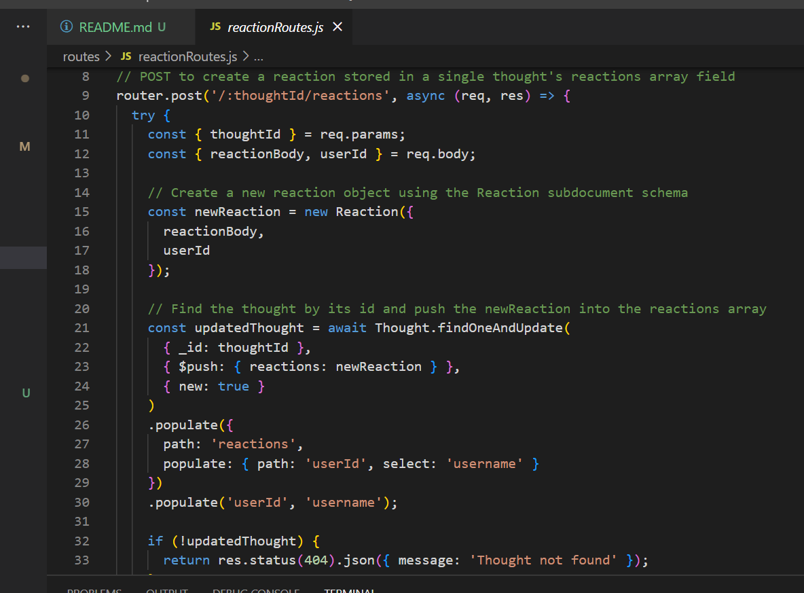
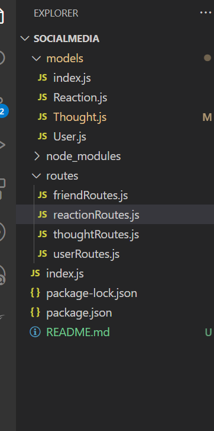
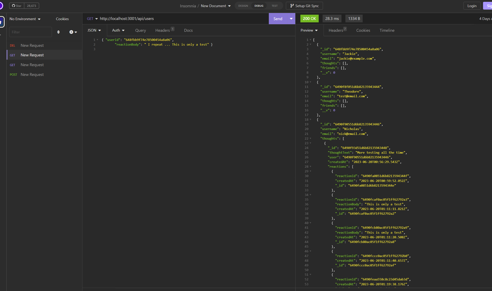

# Social Network API 

## Description

The main focus of this project was to create a Social Network API that uses MongoDB to handle the data. It uses Express.js for routing, MongoDB for database, and Mongoose    

## Table of Contents

- [Pictures](#pictures)
- [Usage](#usage)
- [Questions](#questions)

## Pictures
This is some of my code 

This is my file structure

This is what some of my testing on insomnia looked like

## Usage

Here's a step-by-step guide to use this API.

### Prerequisites:

Node.js and npm should be installed on the user's machine.
Insomnia (or any other API testing tool) should be installed.
### Step 1: Clone the Repository
1. Open a terminal or command prompt.
2. Change the current directory to the desired location where the project will be cloned.
3. Run the following command to clone the repository:
git clone https://github.com/<your-username>/<your-repo-name>.git
   Replace <your-username> and <your-repo-name> with your GitHub username and the name of your repository.
### Step 2: Install Dependencies 
1. From the terminal in your projects root directory run npm install 
### Step 3: Start the Server 
1. After the dependencies are installed, start the server by running the following command: npm start
This will start the server on http://localhost:3001
### Step 4: Test the API using Insomnia
1. In Insomnia or any other API testing tool. Create a new request by clicking the "New Request" button or selecting "New Request" from the menu.
2. Set the HTTP method (GET, POST, PUT, DELETE) and enter the URL of the endpoint you want to test. Use the appropriate endpoints provided by the  API, such as http://localhost:3001/thoughts for GETting all thoughts
3. Set any required headers or request body parameters based on the API's documentation. Click the "Send" button to send the request.
   

## Questions

For questions, please contact:

- Email: smilie_kay@yahoo.com
- GitHub: github.com/SmilieKay